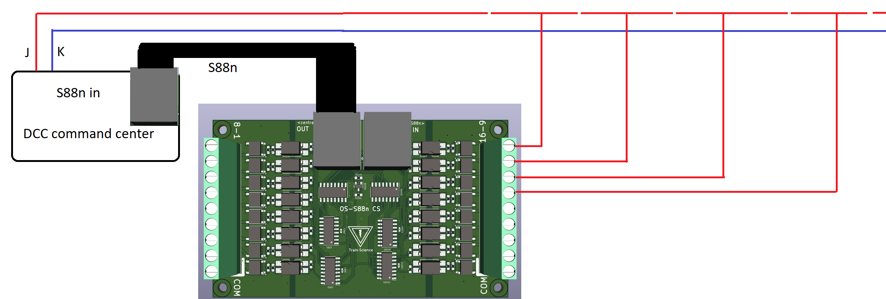
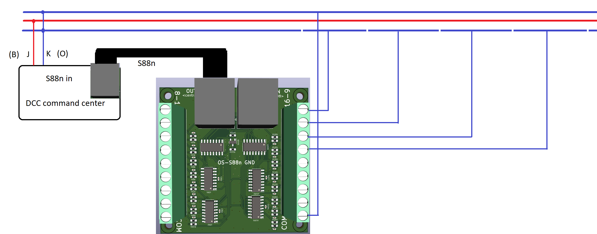

# OS-S88n Feedback Modules Manual
Supports: OS-S88n GND, OS-S88n CS, OS-S88n OPTO

## 📘 Introduction
The OS-S88n modules provide feedback functionality for DCC model railroads using the standardized S88n protocol. These modules allow real-time monitoring of block occupancy and layout events by sending data to your command station or PC-based software.

Models:
    • OS-S88n GND — Standard input module using ground-contact detection  
    • OS-S88n CS — current-sensing module  
    • OS-S88n OPTO — Opto-isolated module for clean, noise-free sensor inputs  

All versions include:
    • Daisy-chainable S88n connectors (RJ-45)  
    • Screw terminals for simple input wiring  
    • Compatibility with all major command stations and software (iTrain, Rocrail, Windigipet, etc.)

---

## 📚 Table of Contents
    1. 📘 Introduction  
    2. ⚖️ Module Variants: GND vs CS vs OPTO  
    3. 🔧 Features  
    4. 🔌 Connecting the OS-S88n Modules  
    5. ⚡ Troubleshooting  

---

## ⚖️ Module Variants: GND vs CS vs OPTO

🟡 OS-S88n GND (Ground Contact Detection)
    • 16 inputs triggered by contact-to-ground  
    • Compatible with:  
        ◦ Reed switches  
        ◦ Push buttons  
        ◦ Axle-based rail contact (metal wheelsets bridging rails)  
    • ⚠️ suitable for 3-rail systems (e.g., Märklin)

🟢 OS-S88n CS (Current Sensing)
    • 16 inputs using internal current sensors  
    • Detects any rolling stock drawing current (loco, lighted car, resistor-equipped wagons)  
    • suitable for both 2-rail and 3-rail digital layouts  

🔵 OS-S88n OPTO (Opto-Isolated Input Detection)
    • 16 opto-isolated digital inputs  
    • Provides electrical isolation between sensors and the S88 bus  
    • Ideal for:  
        ◦ External electronics  
        ◦ Hall sensors  
        ◦ IR detectors  
        ◦ Switches located far from the module  
        ◦ Very noise-sensitive environments  
    • COM is isolated per input group  
    • ⚠️ Does NOT detect track occupancy by itself — external sensors required  

---

## 🔧 Features
    • Fully compatible with the S88n feedback protocol  
    • RJ-45 connectors for signal daisy-chaining  
    • Supports up to 16 inputs per module  
    • Stack up to 31 modules in a chain  
    • Screw terminals for all sensor connections  
    • OPTO version provides full galvanic isolation  

---

## 🔌 Connecting the OS-S88n Modules

Power and Signal
    • S88n OUT → command station or previous module  
    • S88n IN → next module (leave empty on last module)  
    • Use standard UTP Ethernet cables (with all 8 wires connected)  
⚠️ Some cheap Ethernet cables are not fully wired internally — avoid them  

Sensor Wiring

OS-S88n GND
    • Suitable for 3-rail Märklin layouts  

OS-S88n CS
    • Any current draw activates the input  

OS-S88n OPTO
    • Input is read through an optocoupler  

*Wiring of Current Sense version*

*Wiring of GND version*

⚠️ *When using the S88 GND version on a 3-rail layout, it is imperiative that the used Command Centers and boosters are Common Ground type. If you will attempt to use the S88 GND version on a Command Center that uses an H bridge, you will destroy your command center. In this case, use the OPTO variant instead.*

*Wiring op OPTO version*

*Daisy chaining of several OS-S88n modules*

---

## ⚡ Troubleshooting
    • No feedback received?  
        ◦ Check RJ-45 cabling  
        ◦ Ensure all 8 conductors are present  
        ◦ Confirm OUT goes to the command station  

    • False triggers?  
        ◦ GND version: look for wiring interference  
        ◦ CS version: check minimum current draw (LED cars may need resistors)  
        ◦ OPTO version: check sensor supply voltage and polarity  
        ◦ Avoid Ethernet cables longer than 5m  

    • Delayed feedback?  
        ◦ Reduce polling interval in command station or PC  
        ◦ Verify correct input addressing  
