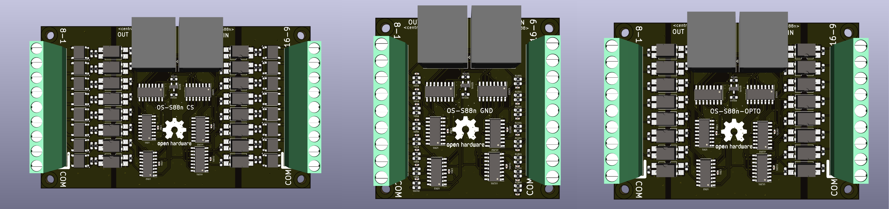
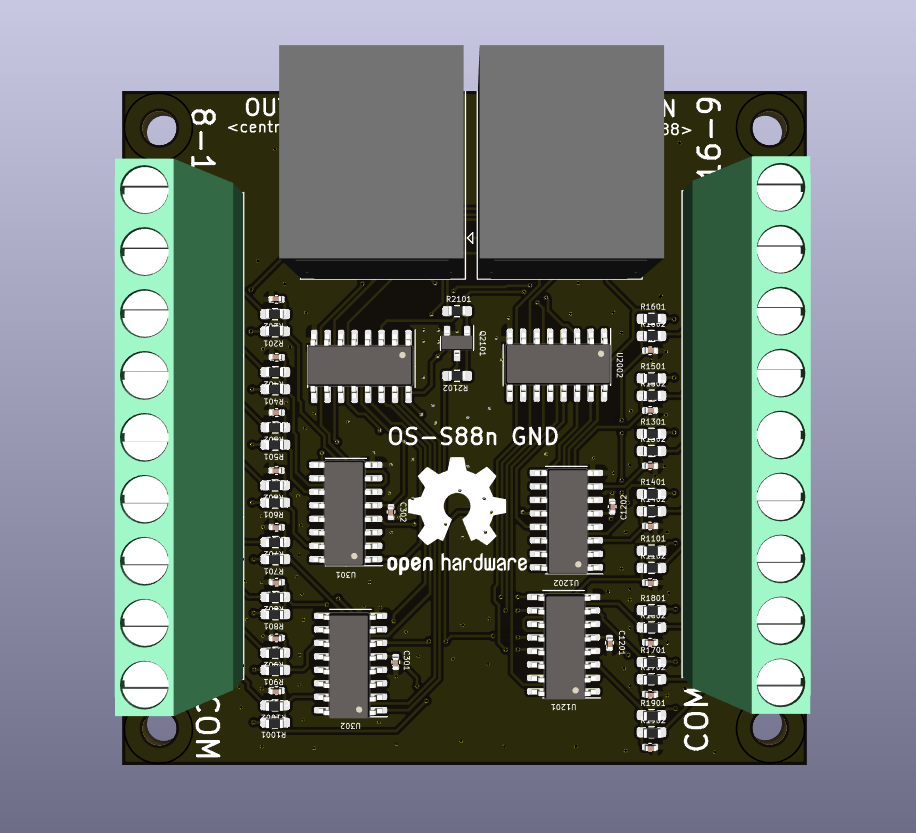
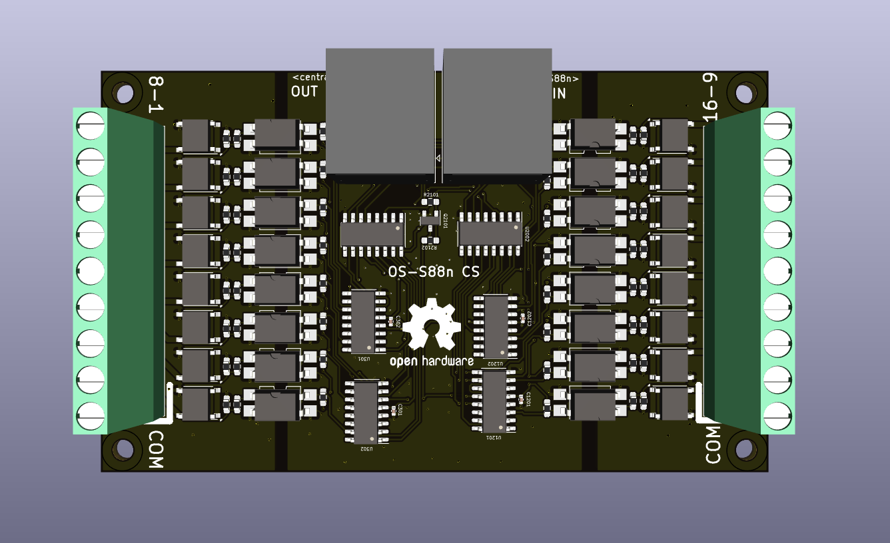
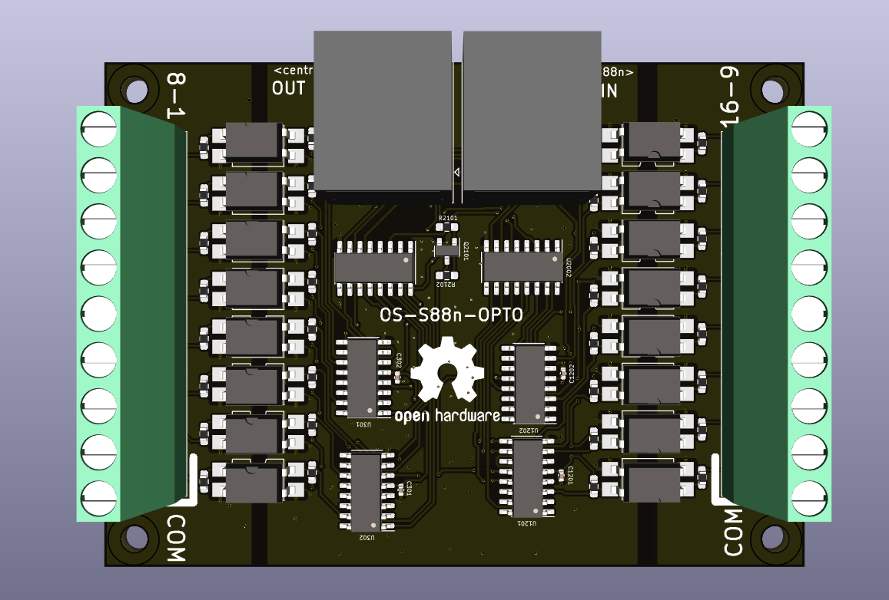
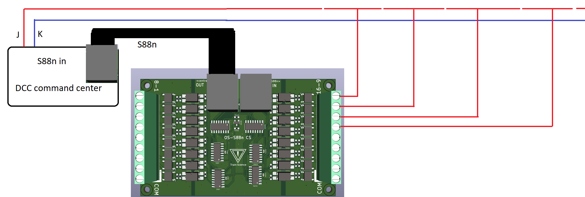
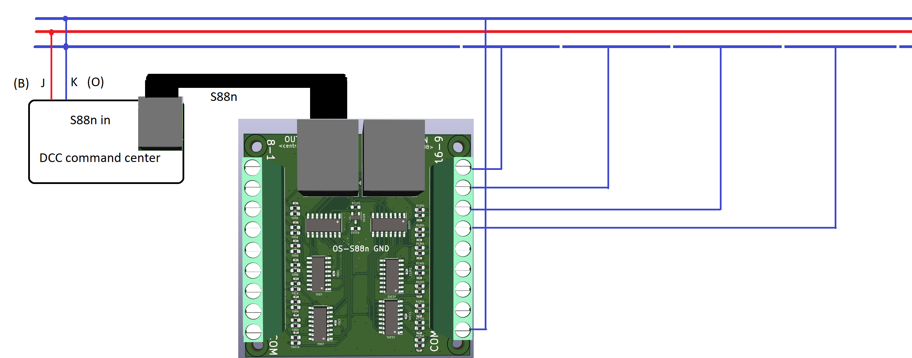
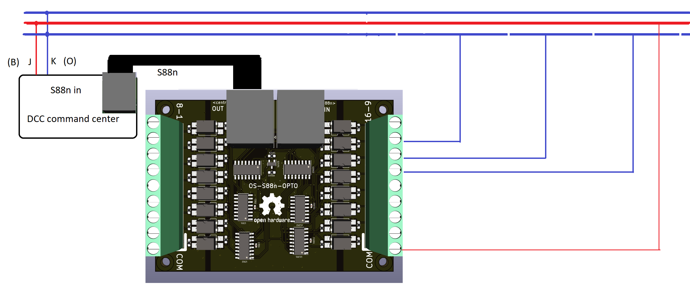
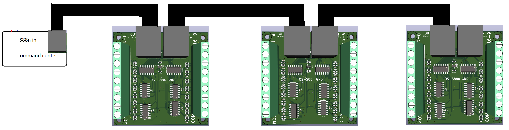

> 🌐 &nbsp; [🇬🇧 EN](Manual-EN.md) &nbsp;|&nbsp; [🇩🇪 DE](Manual-DE.md) &nbsp;|&nbsp; [🇫🇷 FR](Manual-FR.md) &nbsp;|&nbsp; [🇳🇱 NL](Manual-NL.md) &nbsp;|&nbsp; [🇪🇸 ES](Manual-ES.md) &nbsp;|&nbsp; [🇮🇹 IT](Manual-IT.md) &nbsp;|&nbsp; [🇵🇱 PL](Manual-PL.md) &nbsp;|&nbsp; [🇨🇿 CS](Manual-CS.md) &nbsp;|&nbsp; [🇩🇰 DA](Manual-DA.md) &nbsp;|&nbsp; [🇳🇴 NO](Manual-NO.md) &nbsp;|&nbsp; [🇸🇪 SV](Manual-SV.md) &nbsp;|&nbsp; 🇭🇺 HU &nbsp;|&nbsp; [🇵🇹 PT](Manual-PT.md)

# OS-S88n Visszajelző Modulok Kézikönyve

**Támogatja: OS-S88n GND · OS-S88n CS · OS-S88n OPTO**

*Balról jobbra: OS-S88n CS, OS-S88n GND, OS-S88n OPTO*

---

## Bevezetés

Az OS-S88n modulok visszajelzési funkciót biztosítanak DCC modellvasutakhoz a szabványos S88n protokoll segítségével. Ezek a modulok valós idejű blokk-foglaltsági és pályaesemény-figyelést tesznek lehetővé, az adatokat a parancsvezérlőhöz vagy PC-alapú vezérlő szoftverhez továbbítva.

Három változat érhető el a különböző érzékelési igényekhez:

- **OS-S88n GND** — földkontaktusos érzékelés, 3 sínes (Märklin-stílusú) pályákhoz alkalmas
- **OS-S88n CS** — áramfigyeléses érzékelés, 2 sínes és 3 sínes digitális pályákhoz alkalmas
- **OS-S88n OPTO** — optoizolált digitális bemenetek, külső érzékelőkkel, pl. IR detektorokkal vagy Hall-érzékelőkkel való használatra

Minden változat tartalmaz:

- Láncolható S88n csatlakozókat (RJ-45)
- Csavartalpas csatlakozókat az összes érzékelő bekötéséhez
- Kompatibilitást az összes főbb parancsvezérlővel és szoftverrel (iTrain, Rocrail, Windigipet stb.)

---

## Modul Változatok

### OS-S88n GND — Földkontaktusos Érzékelés

A GND modul 16 bemenete akkor aktiválódik, ha a bemenetet földre húzzák. Kompatibilis érzékelők és érzékelési módszerek:

- Nádrelék
- Nyomógombok
- Fémkerék-párok, amelyek a 3 sínes (Märklin-stílusú) pályán áthidalják a síneket

⚠️ **Fontos — 3 sínes pályák:** Ha a GND modult 3 sínes pályán használod, a parancsvezérlőnek és az összes erősítőnek **közös földelésű** típusnak kell lennie. Ha a parancsvezérlő H-híd kimenetet használ, a GND modul alkalmazása **megrongálja a parancsvezérlőt**. Ez esetben inkább az OPTO változatot használd.

---

### OS-S88n CS — Áramfigyelés

A CS modul 16 bemenete akkor aktiválódik, amikor áram folyik át a figyelt pályaszakaszon. Minden gurulóállomány, amely áramot vesz fel, kiváltja az érzékelést, beleértve:

- Mozdonyokat
- Megvilágított kocsikat
- Érzékelési célból ellenállással felszerelt vagonokat

Alkalmas mind 2 sínes, mind 3 sínes digitális pályákhoz.

---

### OS-S88n OPTO — Optoizolált Bemeneti Érzékelés

Az OPTO modul 16 teljesen optoizolált digitális bemenettel rendelkezik. Az érzékelők és az S88 busz közötti teljes galvanikus szigetelés ezt a változatot ideálissá teszi:

- IR detektorokhoz
- Hall-érzékelőkhöz
- A modultól messze elhelyezett kapcsolókhoz
- Zajérzékeny környezetekhez
- Olyan pályákhoz, ahol a földhurok vagy elektromos zavar problémát okoz

⚠️ Az OPTO modul önállóan **nem** érzékeli a sínfoglaltságot — logikai szintű jelet adó külső érzékelőkre van szükség.

---

## Jellemzők

- Teljes kompatibilitás az S88n visszajelző protokollal
- RJ-45 csatlakozók a modulok láncolásához
- 16 bemenet modulonként
- Legfeljebb 31 modul fűzhető egy láncba
- Csavartalpas csatlakozók az összes érzékelő bekötéséhez
- Az OPTO változat teljes galvanikus szigetelést biztosít

---

## A Modulok Csatlakoztatása

### Tápellátás és Jel

Csatlakoztasd a modulokat a parancsvezérlőhöz szabványos UTP Ethernet kábelekkel. **Mind a 8 érnek csatlakoztatva kell lennie** — kerüld az olcsó patch kábeleket, amelyekből hiányoznak a belső erek.

- **S88n OUT** csatlakozó → parancsvezérlő S88n bemenete (vagy az előző modul IN-je)
- **S88n IN** csatlakozó → következő modul a láncban (a lánc utolsó modulján üresen hagyni)

### Érzékelő Bekötése

**OS-S88n CS — áramfigyelés**

Vezésd át az egyes érzékelési szakaszok sínáramvezékeit az áramfigyelő bemeneteken. Minden olyan jármű, amely áramot vesz fel az adott szakaszon, aktiválja a megfelelő bemenetet.

---

**OS-S88n GND — földkontaktus**

Csatlakoztass egy sínt (vagy érzékelő kimenetet) egy bemeneti csatlakozóhoz, a közös sínt pedig a COM csatlakozóhoz. Az egymást érintő kerékpárok mindkét sínen áthidalják az áramkört földre és kiváltják a bemenetet.

⚠️ *Ha a GND változatot 3 sínes pályán használod, elengedhetetlen, hogy a parancsvezérlő és az erősítők közös földelésű típusúak legyenek. Ha a GND változatot H-híd parancsvezérlővel használod, tönkreteszed a parancsvezérlőt. Helyette használd az OPTO változatot.*

---

**OS-S88n OPTO — optoizolált**

Csatlakoztasd az érzékelő jelkimenetét a bemeneti csatlakozóhoz, az érzékelő földjét pedig a COM csatlakozóhoz. A bemeneti feszültség az érzékelő tápellátásától függ; ellenőrizd a lap jelöléseit a támogatott tartományhoz.

---

**Több modul láncolása**

Csatlakoztasd minden modul OUT-ját a következő modul IN-jéhez. Az első modul OUT-ja megy a parancsvezérlőhöz. A lánc utolsó moduljának IN csatlakozóját hagyd üresen.

---

## Hibaelhárítás

**Nem érkezik visszajelzés**
- Ellenőrizd az RJ-45 kábelezést, és győződj meg arról, hogy mind a 8 ér jelen van
- Ellenőrizd, hogy az OUT csatlakozó a parancsvezérlő felé mutat (nem az IN)
- Ellenőrizd, hogy a szoftverben beállított modulcím-tartomány megfelel a modul helyzetének a láncban

**Hamis aktiválódások**
- GND változat: ellenőrizd a rövidzárlatokat vagy zavarokat az érzékelési szakaszok között
- CS változat: ellenőrizd a minimális áramfelvételt — csak LED-es vagonokhoz ellenállás szükséges a kiváltáshoz
- OPTO változat: ellenőrizd az érzékelő tápfeszültségét és a jel polaritását
- Kerüld az 5 m-nél hosszabb Ethernet kábeleket

**Késleltetett visszajelzés**
- Csökkentsd a lekérdezési intervallumot a parancsvezérlőn vagy a PC szoftverben
- Ellenőrizd a helyes bemeneti címzést a szoftverben
